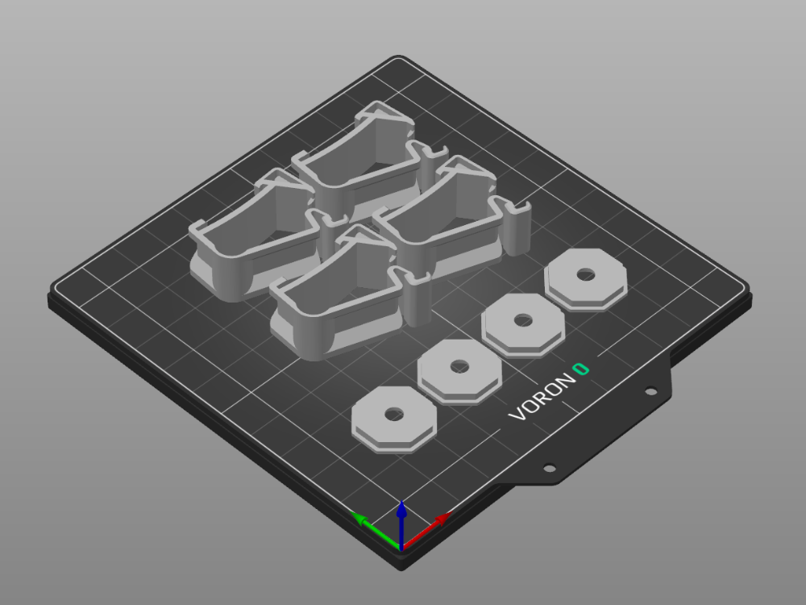

This is a custom build plate model for the Voron 0 to be used in the PrusaSlicer and it's derivatives.

# Installation

On Windows the original Bed Shape files are located at `%ProgramFiles%\Prusa3D\PrusaSlicer\resources\profiles\PrusaResearch`.
You can import files from everywhere, but I put my custom files there as well.

In `PrusaSlicer` in the `Printers` Tab, `General Settings`, click the `Set` Button for the `Bed Shape` in the `Size and coordinates`section and select the STL file and image. 